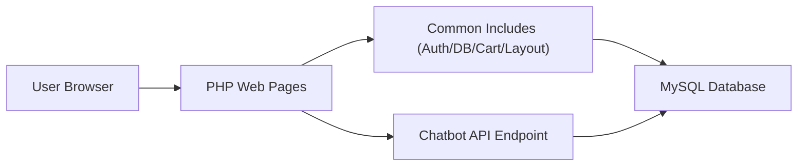
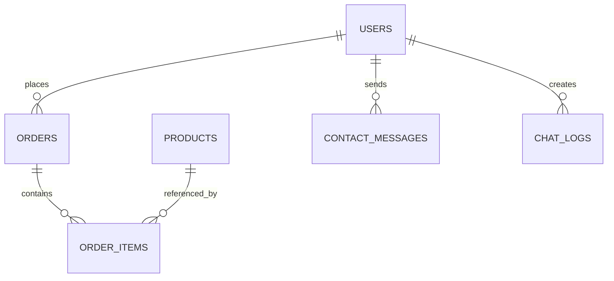

# PROJECT REPORT

## Organic Farming E-Commerce and Advisory Platform

### Academic Year: 2025-2026
### Technology Stack: PHP, MySQL, HTML, CSS, JavaScript
### Team Size: 2-3 Students

---

## Cover Page Details (Fill Before Final Submission)
- Institute Name:
- Department:
- Course Name:
- Subject:
- Project Title: Organic Farming E-Commerce and Advisory Platform
- Team Members:
  - Member 1 (Roll No):
  - Member 2 (Roll No):
  - Member 3 (Roll No):
- Guide Name:
- Submission Date:

---

## Certificate (Template)
This is to certify that the project titled "Organic Farming E-Commerce and Advisory Platform" is a bona fide work carried out by the above students under my guidance and supervision as a part of curriculum requirements.

Guide Signature:  
HOD Signature:  
Principal Signature:

---

## Declaration (Template)
We hereby declare that this project report and implementation work are original and completed by us under the guidance of faculty. Any external references used are properly acknowledged.

Student Signatures:

---

## Acknowledgement (Template)
We express our sincere gratitude to our project guide, department faculty, and institute for their support, guidance, and resources during planning, development, testing, and documentation of this project.

---

## Abstract
This project presents a full-stack web application for organic farming product management and online ordering with advisory support. The system was developed using Software Development Life Cycle (SDLC) principles and relational database design learned in DBMS coursework. The application includes user registration and login, product catalog, server-side cart, checkout, order history, contact support messaging, and a farming assistant chatbot with persisted chat logs. The backend uses MySQL with normalized tables and referential integrity. The frontend provides responsive, aligned, and interactive pages with user-focused interface behavior. Security controls include password hashing, CSRF validation, and prepared statements. Testing combines manual module testing, UI interaction testing, and automation for chatbot logic. The outcome is an end-to-end, submission-ready academic project that demonstrates software engineering discipline and practical database implementation.

---

## Table of Contents
1. Introduction  
2. Project Planning and SDLC  
3. Software Requirement Specification  
4. System Design  
5. Database Design and Normalization  
6. User Interface Design  
7. Implementation Details  
8. Testing and Validation Summary  
9. Results and Observations  
10. Conclusion  
11. Future Scope  
12. References  
13. Appendices

---

## 1. Introduction

### 1.1 Background
Organic farming is increasingly preferred due to health, sustainability, and environmental benefits. However, many users still rely on fragmented channels for product purchase, order tracking, and farming guidance.

### 1.2 Problem Statement
Earlier static websites cannot provide:
- persistent product and order data,
- secure user authentication,
- transaction-safe checkout,
- centralized support interaction,
- structured advisory assistance.

### 1.3 Proposed Solution
Develop a database-driven web platform where users can register, browse products, add items to cart, place orders, track order history, contact support, and query a farming assistant.

### 1.4 Objectives
1. Build a secure, DB-backed web application.
2. Apply SDLC process from planning to testing.
3. Design normalized relational schema with key constraints.
4. Deliver responsive and interactive user experience.
5. Produce submission-ready technical documentation.

### 1.5 Scope
- In scope:
  - Customer authentication and order lifecycle
  - Product browsing, cart, and checkout
  - Contact and chatbot support
  - Database diagnostics and testing reports
- Out of scope:
  - Online payment gateway integration
  - Full admin dashboard workflow
  - Third-party logistics integration

---

## 2. Project Planning and SDLC

### 2.1 SDLC Model Used
Incremental SDLC with iterative enhancement over a base website:
1. Requirement and planning
2. Design
3. Implementation
4. Testing
5. Deployment and maintenance readiness

### 2.2 Phase-Wise Deliverables

| SDLC Phase | Deliverables |
|---|---|
| Planning | Problem definition, objectives, scope |
| Requirement Analysis | SRS, module requirements, constraints |
| Design | Architecture, ER model, relational schema, UI wire intent |
| Implementation | PHP pages, reusable includes, API, SQL schema |
| Testing | Manual cases, automation script, diagnostics |
| Deployment | XAMPP runbook, DB import script, report docs |

### 2.3 Effort Breakdown (Suggested)

| Task | Estimated Effort |
|---|---|
| Requirements + SRS | 15% |
| DB Design + Normalization | 20% |
| Backend Development | 25% |
| Frontend + UI Enhancement | 20% |
| Testing + Debugging | 10% |
| Documentation | 10% |

---

## 3. Software Requirement Specification (SRS)

### 3.1 Stakeholders
- Customer users
- Project team members
- Faculty evaluator
- Future admin/operator

### 3.2 Functional Requirements
FR-01: User registration with input validation  
FR-02: User login/logout with secure session handling  
FR-03: Product listing with category and search filter  
FR-04: Cart operations (add/remove/clear) on server side  
FR-05: Checkout with address, phone, pincode, payment mode  
FR-06: Order creation with order items and stock update  
FR-07: Order history listing and order details  
FR-08: Contact message storage  
FR-09: Chatbot response generation and log persistence  
FR-10: DB connectivity diagnostics page

### 3.3 Non-Functional Requirements
NFR-01 Security: hashed passwords, CSRF protection, prepared queries  
NFR-02 Reliability: DB transaction for checkout consistency  
NFR-03 Performance: optimized SQL and indexed keys  
NFR-04 Usability: responsive, aligned, interactive pages  
NFR-05 Maintainability: modular file structure  
NFR-06 Portability: runs on standard XAMPP setup

### 3.4 Constraints
- Localhost execution environment
- MySQL availability required
- Temporary public tunnel required for external sharing

### 3.5 Assumptions
- Apache and MySQL services are running
- SQL schema imported successfully
- Browser supports modern JS features

---

## 4. System Design

### 4.1 High-Level Architecture
Client browser interacts with PHP pages. PHP controllers use reusable include modules. Business logic persists data in MySQL through PDO prepared statements.



### 4.2 Component Design
- `includes/bootstrap.php`: auth/session/csrf/flash helpers
- `includes/db.php`: database configuration and PDO connection
- `includes/cart.php`: server-side cart state and summary
- `includes/layout.php`: shared header/footer and navigation
- `includes/chatbot_engine.php`: domain response logic
- `api/chatbot_reply.php`: chat API + persistence

### 4.3 Security Design
1. Password hashes via PHP `password_hash` and `password_verify`
2. CSRF token generated per session and validated on POST
3. Protected routes through `requireLogin()`
4. SQL injection prevention through prepared statements
5. Session regeneration on login

---

## 5. Database Design and Normalization

### 5.1 ER Relationships
1. User places many orders
2. One order has many order items
3. One order item references one product
4. User can submit many contact messages
5. User can create many chat logs



### 5.2 Relational Schema
- `users(id PK, full_name, email UNIQUE, password_hash, role, created_at)`
- `products(id PK, sku UNIQUE, name, category, unit, price, stock_qty, image_url, description, is_active, created_at)`
- `orders(id PK, order_code UNIQUE, user_id FK, status, payment_mode, subtotal, delivery_charge, total_amount, customer_name, phone, address_line, pincode, expected_delivery, created_at)`
- `order_items(id PK, order_id FK, product_id FK, product_name, unit_price, quantity, line_total)`
- `contact_messages(id PK, user_id FK NULL, name, email, message, status, created_at)`
- `chat_logs(id PK, user_id FK NULL, user_message, bot_response, category, created_at)`

### 5.3 Normalization
1NF:
- All tables contain atomic fields.

2NF:
- Attributes fully depend on complete primary key (especially in `order_items`).

3NF:
- No transitive dependencies in operational entities.
- Separate entities for users, products, orders, logs, and messages.

### 5.4 Data Dictionary (Condensed)

| Table | Key Columns | Purpose |
|---|---|---|
| users | id, email | customer identity and login |
| products | id, sku | catalog and inventory source |
| orders | id, order_code, user_id | order header and delivery/payment info |
| order_items | order_id, product_id | line-level order breakup |
| contact_messages | user_id, email | support communication |
| chat_logs | user_id, category | chatbot interaction history |

---

## 6. User Interface Design

### 6.1 UI Principles Applied
- Consistent alignment and spacing
- Readable typography hierarchy
- Responsive grid and stacking
- Button/form feedback and focus states
- Hover and reveal interactions for improved usability

### 6.2 Page-Wise GUI Description
1. `register.php` and `login.php`:
   - centered auth card, validated forms
2. `index.php`:
   - dashboard stats, recent orders table, action buttons
3. `products.php`:
   - filter controls, product cards, cart snapshot
4. `cart.php`:
   - itemized table and aligned billing summary
5. `order.php`:
   - checkout form and bill summary panel
6. `order_history.php`:
   - filterable order records table
7. `order_success.php`:
   - confirmation and order breakdown
8. `contact.php`:
   - support information tiles and message form
9. `chatbot.php`:
   - quick prompts, chat feed, async response
10. `db_health.php`:
   - connectivity diagnostics and setup guidance

---

## 7. Implementation Details

### 7.1 Directory Structure
```text
Organic Farming/
  api/
  docs/
  includes/
  sql/
  tests/
  *.php pages
  style.css
  script.js
```

### 7.2 Key Implementation Highlights
1. Centralized helper includes reduce duplication.
2. Cart state maintained in PHP session, not client-only storage.
3. Checkout uses DB transaction for data consistency.
4. Stock decrement guarded with quantity checks.
5. Chatbot logs each interaction for analysis.
6. DB health page improves troubleshooting.

### 7.3 Algorithms (Conceptual)
Algorithm A: Add to Cart  
- Validate token and product status  
- Validate stock and quantity  
- Update session cart map

Algorithm B: Place Order  
- Validate customer input  
- Begin transaction  
- Insert order header  
- Insert each order item  
- Update product stock  
- Commit or rollback on failure

Algorithm C: Chatbot Response  
- Token and message validation  
- Intent matching by keywords  
- Return category-specific guidance  
- Persist message and response in DB

---

## 8. Testing and Validation Summary

Testing details are provided in `docs/TESTING_DOCUMENT.md`.

Summary:
1. Functional manual testing for all modules
2. UI interaction testing for alignment and responsiveness
3. Security validations (CSRF, protected routes, invalid credentials)
4. Automation script for chatbot engine logic
5. Syntax validation across PHP files

---

## 9. Results and Observations

### 9.1 Achievements
- End-to-end flow from registration to order confirmation
- Reliable relational schema and transactional checkout
- Improved user experience through interactive UI behavior
- Structured support and chatbot logging

### 9.2 Observed Benefits
- Better data integrity with foreign keys and constraints
- Easier maintenance with modular code
- Faster debugging through diagnostics and separated concerns

---

## 10. Conclusion
The project successfully demonstrates practical application of software engineering process and database design concepts. The final implementation is secure, modular, and functionally complete for the academic scope. It supports real data persistence, normalized schema usage, and validated workflows. The enhanced UI and interaction quality improve usability while preserving maintainable architecture.

---

## 11. Future Scope
1. Admin panel for product/order/message management
2. Online payment gateway integration
3. Email/SMS order notifications
4. Delivery tracking integration
5. Recommendation engine based on order history
6. Role-based analytics dashboard
7. Multi-language UI support

---

## 12. References
1. PHP Official Documentation - https://www.php.net/docs.php  
2. MySQL Official Documentation - https://dev.mysql.com/doc/  
3. OWASP Web Security Guidelines - https://owasp.org/www-project-top-ten/  
4. Software Engineering Textbook Notes (course material)  
5. DBMS Concepts and Normalization (course material)

---

## 13. Appendices

### Appendix A: Setup Steps
1. Start Apache and MySQL
2. Import `sql/schema.sql`
3. Open `register.php` and create account
4. Login and test full workflow

### Appendix B: Important Files
- `includes/bootstrap.php`
- `includes/db.php`
- `includes/cart.php`
- `includes/layout.php`
- `api/chatbot_reply.php`
- `sql/schema.sql`
- `tests/chatbot_engine_test.php`

### Appendix C: Viva Quick Points
1. Explain why transaction is used in checkout.
2. Explain how CSRF token works.
3. Explain 1NF, 2NF, 3NF with your tables.
4. Explain difference between order header and order item tables.
5. Explain secure password storage and verification.
